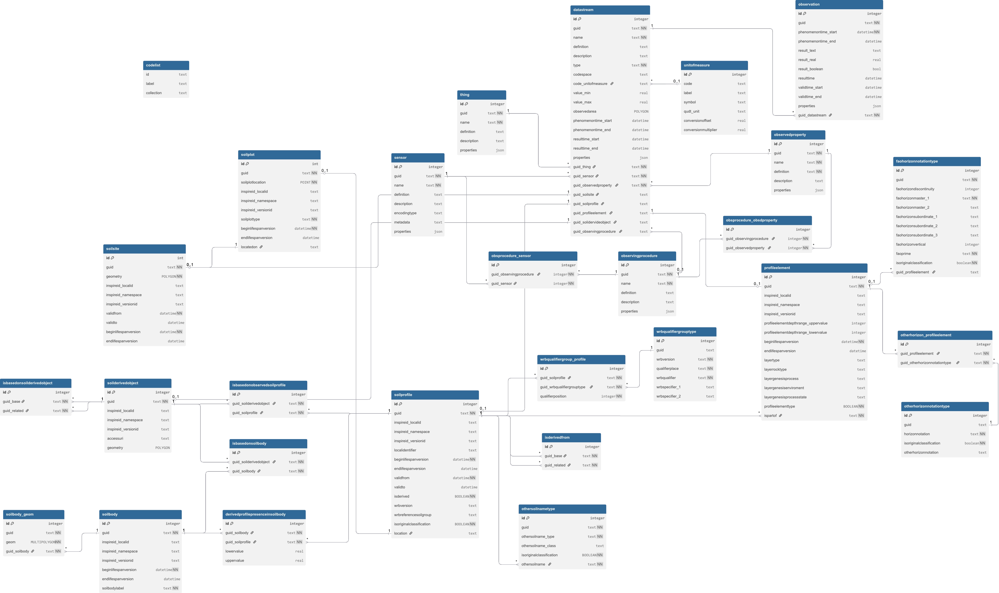

# Soilwise GeoPackage

## Introduction to the **Soilwise** GeoPackage (SQLite)

The **Soilwise** GeoPackage is the relational (SQLite‑based) container adopted by the **SoilWise** project (Horizon Europe – Mission Soil) to enable **exchange, storage, and GIS‑native use** of soil data, with the explicit goal of making them **FAIR** and reusable across European policies, research, and land‑management workflows.[^1][^2]

SoilWise provides an **integrated, actionable entry point** to scattered soil data and knowledge, recognising existing workflows and repositories and connecting to them through a **modular, scalable** architecture designed to last beyond the project horizon and co‑created with stakeholders.[^1][^2]

## Why GeoPackage/SQLite

**GeoPackage** is an **OGC** open, portable, self‑contained standard for geospatial data. Being an SQLite container, it allows **direct** use of vector features, rasters/tiles and attribute data in a **single file**, without intermediate format translations. This makes it ideal for GIS environments and for constrained connectivity scenarios.[^3][^4]

Within the INSPIRE ecosystem, an **endorsed Good Practice** describes how to design and publish **INSPIRE datasets encoded as GeoPackage**, while preserving legal and technical compliance with the Implementing Rules (with technical conformity demonstrable through transformation to the default encoding, **GML**). The Good Practice promotes logical models **optimised for GIS usability**, with explicit mapping rules from the INSPIRE conceptual model.[^5][^6]

## Continuity with INSPIRE: from EJP SOIL to **Soilwise**

The **Soilwise** database builds upon—and updates—the work carried out around INSPIRE, including the **EJP SOIL** GeoPackage template for the **Soil (SO)** theme.  
That template focused on **semantic harmonisation**, **code‑list management**, and **repeatable transformations**, and is a relevant baseline for Soilwise’s relational modelling approach.[^7]

This direction aligns with community guidance on publishing INSPIRE data as a **relational database** (GeoPackage as a specialisation of SQLite), including recipes and patterns for harmonisation and publication.[^8]

## Data architecture and governance

In line with the **INSPIRE Good Practice**, each GeoPackage logical schema should be accompanied by:

- a **model description** (including benefits and limitations compared to the default encoding);
- an **empty GeoPackage template** for distribution;
- an **executable specification** for model transformation (**UML→GPKG** or **GML→GPKG**), aligned with the generic INSPIRE transformation rules.[^5]

This approach ensures **traceable compliance**, supports reuse across thematic communities, and allows **use‑case‑specific** logical models while preserving a coherent methodological and semantic framework.[^5]

## Integration with **OGC SensorThings API 2.0 (STA2)**

Within SoilWise, an implementation of **OGC SensorThings API 2.0 (STA2)** is used to expose **observations** and **metadata** as **interoperable time series** via HTTP and MQTT, consistent with **O&M / ISO 19156:2023**.

The **STA2** draft (OGC document **23‑019**) updates the data model and bindings (e.g., OData 4.01 alignment), strengthening the API’s role as a standards‑based **“data‑in‑motion”** complement to the GeoPackage’s **“data‑at‑rest”** layer.[^9][^10]

The growing adoption of SensorThings for observational data (well beyond narrow IoT use) is documented by OGC/WMO community materials, which highlight alignment with the renewed **OMS/ISO 19156:2023** standard and integration with GIS tools.[^11][^12]

## QGIS usage and custom forms

The **Soilwise** GeoPackage is **natively supported by QGIS**, enabling editing, styling, and map production with no format conversion.

To improve data‑entry quality and speed, we recommend configuring **custom attribute forms** (widgets, value map/relation, constraints and expressions) and adopting a **design of tabs and groups** aligned with project code lists and validation processes.[^13][^14]

# Relational Structure of the GeoPackage (INSPIRE UML + STA2 Transposition)

::: tip
Click the image to see it full‑size for better viewing.
:::

## Purpose and framing

This GeoPackage implements a **relational schema** that is a **faithful transposition** of the **INSPIRE Soil conceptual model (UML)** and its classes/associations, as described in the **INSPIRE Soil Technical Guidelines** and Feature Catalogue.  
It also integrates the **OGC SensorThings API 2.0 (STA2)** model for the management and exposure of **observations** (time‑series and observation metadata).[^5][^9][^10]

::: note
The Soil Technical Guidelines provide the authoritative description of the Soil theme, including the Feature Catalogue and the UML‑based relationships among elements (which underpin any encoding, such as GML or GeoPackage).[^5]
:::

## Sources of the model (normative and technical)

- **INSPIRE Soil – Technical Guidelines**: Feature catalogue, UML, implementation guidance.[^5][^15]
- **INSPIRE Good Practice – GeoPackage encoding**: GIS‑oriented logical models, GML mapping, compliance rules.[^5][^6][^15]
- **OGC SensorThings API 2.0 (STA2)**: Things, Datastreams, Observations, Sensors, ObservedProperties, HTTP/MQTT bindings.[^9][^10]

## From UML to a relational GeoPackage (SQLite)

1. **UML Classes → Tables**  
   Feature Types → tables; attributes → typed columns; spatial attributes → `geometry`.  
   Based on GeoPackage & INSPIRE rules.[^3][^4][^5][^15]

2. **UML Associations → Foreign Keys**  
   Cardinalities enforced via foreign keys or link tables, preserving the chain  
   **Site → Plot → Profile → ProfileElement**.[^5][^15]

3. **Code lists → Reference tables**  
   Controlled vocabularies represented as code‑list tables with  
   **URI / notation / label / authority / version**.[^5][^15]

4. **Observational component (STA2)**  
   STA2 entities mapped to dedicated tables; Observations reference Datastreams and store  
   `phenomenonTime`, `resultTime`, and `result`.[^9][^10]

::: note
GeoPackage is an OGC portable, self‑contained SQLite container ideal for offline GIS workflows.[^3][^4]  
INSPIRE Good Practice recognises it as an additional/alternative encoding to GML.[^5]
:::

## Key INSPIRE Soil features (concise overview)

::: note
Short summaries aligned with the official Soil Feature Catalogue. Full details in the Technical Guidelines.[^5]
:::

- **SoilSite** — Context/area of investigation; container for investigations.[^5]  
- **SoilPlot** — Investigation point/portion; contained in SoilSite.[^5]  
- **SoilProfile** — Vertical section used to describe horizons/layers.[^5]  
- **ProfileElement** — Horizon or layer (SoilHorizon or SoilLayer).[^5]  
- **SoilBody** — Mapping unit linked to representative profiles.[^5]

# Data Loading & Modelling Guide

See **./data_loading.md** for practical steps:

- order of loading datasets  
- dependencies  
- constraints to respect  
- checks before/after loading

::: important
If you need to **populate or update** the GeoPackage, **start here**.
:::

# QGIS Manual

See **[A practical guide](./qgis/README.md)** for using QGIS to **read/write** the GeoPackage, including **custom Forms**.

### Custom Forms

- guided fields (drop‑downs, defaults, help)
- validation checks
- sections grouping frequent fields
- actions for automation

::: warning
QGIS version **3.44.0 – Solothurn** or higher is required.
:::

# Database Tables

This chapter describes all database tables:

- their **purpose**
- **key fields**
- **geometry**
- **relationships**
- usage notes

List of tables:

- ./tables/codelist.md  
- ./tables/datastream.md  
- ./tables/derivedprofilepresenceinsoilbody.md  
- ./tables/faohorizonnotationtype.md  
- ./tables/isbasedonobservedsoilprofile.md  
- [isbasedonsoilbody](./tables/isbasedonsoilbody.md)  
- [isbasedonsoilderivedobject](./tables/isbasedonsoilderivedobject.md)  
- [isderivedfrom](./tables/isderivedfrom.md)  
- [observation](./tables/observation.md)  
- [observedproperty](./tables/observedproperty.md)  
- ./tables/observingprocedure.md  
- ./tables/obsprocedure_obsdproperty.md  
- [obsprocedure_sensor](./tables/obsprocedure_sensor.md)  
- [otherhorizon_profileelement](./tables/otherhorizon_profileelement.md)  
- [otherhorizonnotationtype](./tables/otherhorizonnotationtype.md)  
- [othersoilnametype](./tables/othersoilnametype.md)  
- ./tables/profileelement.md  
- [sensor](./tables/sensor.md)  
- [soilbody](./tables/soilbody.md)  
- [soilbody_geom](./tables/soilbody_geom.md)  
- [soilderivedobject](./tables/soilderivedobject.md)  
- [soilplot](./tables/soilplot.md)  
- ./tables/soilprofile.md  
- [soilsite](./tables/soilsite.md)  
- [thing](./tables/thing.md)  
- [unitofmeasure](./tables/unitofmeasure.md)  
- [wrbqualifiergroup_profile](./tables/wrbqualifiergroup_profile.md)  
- [wrbqualifiergrouptype](./tables/wrbqualifiergrouptype.md)

# Relationship Summary

See **[This document](./relationship_summary.md)** for an overview of how tables connect and when they should be used together.

# Cascade Summary

See **./cascade_summary.md** for explanations on consequences of updates/deletions across related tables.

# Geometric Feature Import

See **[this document](./geometric_feature_import.md)** for details on geometry import, SRIDs, and usability guidance.

---

## References

(References unchanged from original for transparency.)

[^1]: SoilWise – project website.  
[^2]: Mission Soil Platform – SoilWise page.  
[^3]: GeoPackage.org.  
[^4]: OGC – GeoPackage Standard.  
[^5]: INSPIRE GeoPackage Good Practice.  
[^6]: INSPIRE‑MIF GitHub.  
[^7]: EJP SOIL GeoPackage template.  
[^8]: Soil data guidance – relational DB.  
[^9]: OGC SensorThings API 2.0 draft.  
[^10]: OGC SensorThings Standard.  
[^11]: WMO/OGC slides.  
[^12]: BRGM HAL slides.  
[^13]: QGIS Training Manual.  
[^14]: QField documentation.  
[^15]: INSPIRE UML models.
