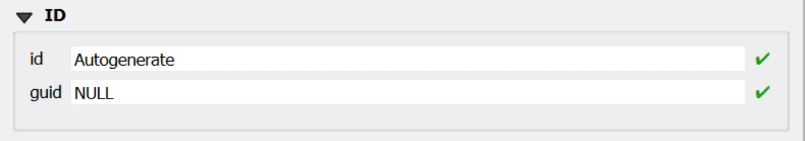

# Datastream Form

## Open
To open the Datastream custom forms, go to the Layers panel, right‑click the `datastream` layer, and choose **Open Attribute Table** from the context menu.

> [!TIP]
> For further information on the custom forms, consult the documents [Customized Attribute Forms in QGIS](./custom_form.md) and [Navigating GeoPackage Tables via Forms](./navigating_via_form.md)  

## Edit

Unlike most attribute‑only tables, **Datastream** includes an **optional geometry** (observedarea as POLYGON, EPSG:3035). This makes editing slightly more complex because a Datastream can behave either as a feature layer (when a geometry is present) or simply as an attribute table (when geometry is NULL). Both cases are valid.

  
Right-click in the "Layers" panel on the "datastream", ① and from the menu, select "Toggle Editing" ②.
  
Alternatively, select only the “datastream” layer ① and click the “Toggle Editing” button ③ in the toolbar.

  

### With geometry

  
A small pencil icon ④ will appear, indicating that the feature is in edit mode.
  
In the toolbar, select the "Add Polygon Feature" icon ⑤ and draw the geometry of the new "Datastream". ⑥

  

  
Right-click to close the geometry, and the data entry form will appear. ⑦

Use the widgets provided by the form to modify data.

  

### Without geometry

  
A small pencil icon ④ will appear, indicating that the feature is in edit mode.
  
Right-click in the "Layers" panel on the "datastream", and from the menu, select "Open Attribute Table" ⑤

  

  
Click the "Add Feature" buttn; ⑥ a new data‑entry form will appear on the right. ⑦

Use the widgets provided by the form to modify data.

  

For detailed information on how to initiate edit mode for a custom form, refer to the [Editing Records Through a QGIS Form](./edit_form.md) documentation.

### Editing Datastream via Child Elements (QGIS Sub‑Forms)
Editing Datastream records through child elements (sub‑forms embedded in the parent form) is the most reliable and efficient workflow for your INSPIRE Soil GeoPackage. It keeps users in context, auto‑populates foreign keys, and mirrors database integrity rules at the point of entry. 

Why “child‑form editing” is the best option for Datastream

Context‑aware data entry: Working inside the parent form (e.g. Soil Site, Soil Profile, Profile Element or Soil Derived Object) ensures the Datastream receives the correct parent keys without manual copying. QGIS relations and their forms are explicitly designed to connect and edit related tables in place.

Integrity by design: The QGIS relation editor widget exposes dedicated child‑layer controls and honors relationship cardinalities, minimizing orphan data and key mismatches. It includes built‑in actions for Add child feature and Save child edits. 

  

  

Use the following buttons to manage child layers during data editing.
  
**Toggle editing mode for child layer** ① enables editing on the related (child) layer embedded in the form; once active, you can add/modify/delete child records directly from the parent record’s view.

**Save child layer edit** ② commits the pending edits for the child layer to the GeoPackage. Use this to persist changes without leaving the parent form.

**Add Polygon Feature** ③ tool in QGIS allows users to create new polygon geometries within an editable vector layer.

**Add child feature** ④ creates a new child record pre‑linked to the current parent (relation fields are auto‑populated by the form’s relation widget), ensuring correct foreign keys and preventing orphan rows.

### REQUIRED fields
- `id`: primary key (auto-incrementing)
- `Begin Lifespan version`: DATETIME (default: today)
- `Valid From`: DATETIME (default: today)
- `isderived`: BOOLEAN (default: 0)
- `isoriginalclassification`: BOOLEAN (default: 1)

### ID Group

  

  

#### Fields

- **`id`** - Primary **AUTO_INCREMENT INTEGER PRIMARY KEY**; it’s the required identifier for GeoPackage tables and is assigned automatically on insert.

- **`guid`** - **Global identifier** in UUID format, stored as text. The field is **optional**. It's **automatically managed via triggers**.

> [!IMPORTANT]
> On opening, the **ID** group is collapsed: there is no need for manual editing, as **both fields are system‑managed** (the `id` by the SQLite engine and the `guid` by triggers), reducing errors and ensuring identifier consistency over time.

### Dynamic Form Behaviour Based on `Is Derived`

The **Soil Profile** data-entry form must adapt dynamically according to the value of the field `soilprofile.isderived`, which determines whether the profile is **Observed** (`0`) or **Derived** (`1`). This behaviour follows the INSPIRE Soil data model and is strictly enforced in the GeoPackage through database triggers and CHECK constraints.

#### `Is Derived = 0` → **Observed Soil Profile**

  
When users select <strong>Observed</strong> -  <strong>The checkbox is unchecked</strong> ①

The form automatically shows the elements related to point‑location and to the contextual relations available for observed profiles.
The <strong>Soil Plot section</strong> becomes visible, ② allowing the selection of the associated soilplot.guid. 

The <strong>Derived Soil Profile section</strong> (representing the isderivedfrom relation where the observed profile may appear as guid_related) also appears,③ along with the <strong>SoilDerived Object</strong> relation area ④.
Attempts to store a NULL or invalid location are blocked by database triggers, ensuring data consistency. 

Interface elements specific to derived profiles—such as derived‑only constraints or soil‑body‑percentage definitions—do not appear while the profile is in Observed mode.
Database logic prevents these derived‑only relations from being created for an observed profile.

  

#### `Is Derived = 1` → **Derived Soil Profile**

  
When users select <strong>Derived</strong> - <strong>The checkbox is checked</strong> ①

The form adjusts by hiding all location‑related components, including the Soil Plot section, since derived profiles are not point‑located. Any non‑NULL value in the location field is rejected by database triggers.

In this mode, the form exposes only the relational structures applicable to derived profiles:

the <strong>Is Derived From section</strong>, ② which represents the association to observed profiles through the isderivedfrom table (where the derived profile appears as guid_base)
the Derived Presence in <strong>Soil Body section</strong>,③ corresponding to the derivedprofilepresenceinsoilbody table, used to express the percentage‑based presence of the derived profile within a Soil Body

These interface elements reflect the constraints, type‑coherence checks, and consistency rules enforced at database level.

  

### INSPIRE ID Group

  

  

>An **INSPIRE ID** is the **external unique identifier** assigned to each spatial object in INSPIRE datasets; it ensures **uniqueness** and **persistence** and allows external applications to reliably reference the same object over time.
The identifier **must not be changed** during the object’s life cycle; it can also be published as a **URI** to facilitate web-based referencing. [^1]

[^1]: Creating INSPIRE external unique object identifiers in the scope of the END reporting.
https://epanet.eea.europa.eu/Eionet/reportnet/docs/noise/guidelines/inspire_identifiers_doc.pdf 

#### Fields

- **`Local id`** — Local identifier assigned by the data provider; **unique** within its namespace.
- **`Namespace`** — Namespace that uniquely identifies the data source/domain of the spatial object. 
- **`Version id`** — Identifier of the specific **version** of the object; **optional (voidable)** and used to distinguish different versions of the same object. 

> [!IMPORTANT]
> These fields are not mandatory, but **filling them out is strongly recommended**: they help uniquely identify the record in forms and across data exchanges.  
> In particular, `localid` + `namespace` form a stable identifier; `versionid` helps track changes over time.

### Editing Child Elements in QGIS Forms
Editing child elements directly within a parent form improves data quality and speed: it keeps users in context, guarantees referential integrity through predefined relations, and reduces errors by enforcing database rules at the moment of entry. In your GeoPackage, several relationships are validated by triggers and codelist checks, so capturing child data where it belongs (inside the parent form) closely aligns UI behavior with DB constraints.

### Sub Form 

  

  

Use the following buttons to manage child layers during data editing.
  
**Toggle editing mode for child layer** ① enables editing on the related (child) layer embedded in the form; once active, you can add/modify/delete child records directly from the parent record’s view.

**Save child layer edit** ② commits the pending edits for the child layer to the GeoPackage. Use this to persist changes without leaving the parent form.

**Add child feature** ③ creates a new child record pre‑linked to the current parent (relation fields are auto‑populated by the form’s relation widget), ensuring correct foreign keys and preventing orphan rows.

### Sub Form WRB Qualifier
**Purpose**: attaches WRB qualifier groups to a soil profile with an explicit qualifierposition (ordering).

**DB enforcement**: triggers align wrbversion between profile and qualifier group, and ensure qualifierposition is unique per qualifierplace within the same profile.

**Form hint**: expose as a child list on the Soil Profile form; use Add child feature to add qualifiers in order, and Save child layer edit to commit.

### Sub Form Other Soil Name
**Purpose**: stores additional soil names and related classification flags for a profile.

**DB enforcement**: codelist checks on othersoilname_type; GUID immutability; cascading rules via FK to soilprofile.

**Form hint**: present as a child panel in the Soil Profile form for quick insertion of multiple alternative names; Save child layer edit to persist

### Sub Form Derived Soil Profile (*Visible if `isderived` = TRUE*) - Is Derived From (*Visible if `isderived` = FALSE*)
**Purpose**: records the association Derived Soil Profile (guid_base) → Observed Soil Profile (guid_related).

**DB enforcement**: triggers guarantee that guid_base points to a derived profile and guid_related to an observed one; duplicates of the same pair are prevented.

**Form hint**: embed this as a child table under Derived Soil Profile; use Add child feature to append observed sources and Save child layer edit to persist.

### Constraints
- **CHECK**: `validfrom <= validto` (BEFORE INSERT/UPDATE).
- **CHECK**: `beginlifespanversion < endlifespanversion` (BEFORE INSERT).
- **Observed/Derived location rule**: if `isderived=1` then `location` must be NULL; if `isderived=0` then `location` must be NOT NULL (BEFORE INSERT/UPDATE).
- **WRB version membership**: `wrbversion ∈ codelist(id)` where `collection='wrbversion'` when not NULL (BEFORE INSERT/UPDATE).
- **WRB RSG + version coherence**: if `wrbversion` targets a specific year, `wrbreferencesoilgroup` must belong to the corresponding year collection (BEFORE INSERT/UPDATE).
- **GUID immutability** and **versioning refresh** on UPDATE.

### Attribute Reference
For an  overview of the **attributes used in the custom form**, refer to the soilsite table  [documentation](../tables/soilplot.md). It provides the key definitions and data types needed to correctly interpret the fields and configure the form within the data model.

## Save

For a more comprehensive overview of form‑saving workflows, refer to the detailed documentation in [Saving Edits in QGIS Forms](./save_form.md).
