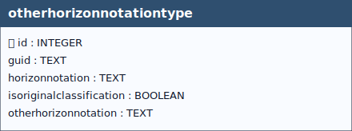

# Other Horizon Notation Type

&nbsp;

  
 <!--
  <strong>TABELLA SOILSITE EXP</strong> 
   Lorem Ipsum.
 -->

 

&nbsp;
 

## Table: `otherhorizonnotationtype`

### Columns

| Name | Type | Constraints | Description |
|------|------|-------------|-------------|
| `id` | `INTEGER` | PRIMARY KEY | Primary Key of the Table. |
| `guid` | `TEXT` |  | Universally unique identifier. |
| `horizonnotation` | `TEXT` | NOT NULL | Notation characterizing the soil horizon according to a specified classification system. |
| `diagnostichorizon` | `TEXT` |  | Codelist wrbdiagnostichorizonvalue. |
| `isoriginalclassification` | `BOOLEAN` | NOT NULL, DEFAULT 0 | Boolean value to indicate whether the specified horizon notation system was the original notation system to describe the horizon. |
| `otherhorizonnotation` | `TEXT` |  |  |

### Table Identifiers
In this table, the primary key is the *id* field (integer, auto-incrementing).  
There is also a text field named **GUID**, which stores a *UUID* (Universally Unique Identifier) compliant with RFC 4122.

Although GUID is not mandatory at the schema level (it is not declared NOT NULL), its functional requirement is enforced by two triggers:
- **otherhorizonnotationtypeguid (INSERT)** trigger: if GUID is missing or empty, a correctly formatted UUID is generated and inserted automatically.
- **otherhorizonnotationtypeguidupdate (UPDATE)** trigger: prevents any modification of GUID after insertion, making it immutable (effectively behaving as a stable key).  

Any foreign keys (FK) from other tables reference this table’s GUID field rather than the id field, ensuring stable and interoperable references across datasets and database instances.

### Relationships (as child)
- None

### Referenced by (as parent)
- `otherhorizon_profileelement.guid_otherhorizonnotationtype` → `otherhorizonnotationtype.guid` (**ON UPDATE** CASCADE, **ON DELETE** CASCADE)

### Indexes

| Name | Unique | Columns | Origin | Partial |
|------|--------|---------|--------|---------|
| `sqlite_autoindex_otherhorizonnotationtype_1` | Yes | `guid` | `u` | No |

### Triggers
For every trigger you will find:

- **When it runs** (BEFORE/AFTER, INSERT/UPDATE/DELETE)
- **What it reads and compares** (columns, lookups in other tables)
- **What happens on success** (the statement proceeds, optional updates)
- **What happens on failure** (the exact error text raised)

 

#### `otherhorizonnotationtypeguid` / `otherhorizonnotationtypeguidupdate`
**When they run:** AFTER INSERT / AFTER UPDATE OF `guid`

**What they do:** Assign GUID at insert when missing; block changes afterwards.

**If the check passes:** Insert writes GUID; unchanged updates proceed.

**If the check fails:** On change, abort with: `Cannot update guid column.`

#### `i_otherhorizonnotationtype` / `u_otherhorizonnotationtype`
**When they run:** BEFORE INSERT / BEFORE UPDATE

**What they do:** Validate `horizonnotation` membership in **OtherHorizonNotationTypeValue**.

**If the check passes:** Statement proceeds.

**If the check fails:** Aborts with: `Table otherhorizonnotationtype: Invalid value for horizonnotation. Must be present in id of otherhorizonnotationtypevalue codelist.`

#### `i_diagnostichorizon` / `u_diagnostichorizon`
**When they run:** BEFORE INSERT / BEFORE UPDATE

**What they do:** If provided, `diagnostichorizon` must exist in the **relative codelist** named by `NEW.horizonnotation`.

**If the check passes:** Statement proceeds.

**If the check fails:** Aborts with: `Table otherhorizonnotationtype: Invalid value for diagnostichorizon. Must be present in the relativecodelist.`

---

